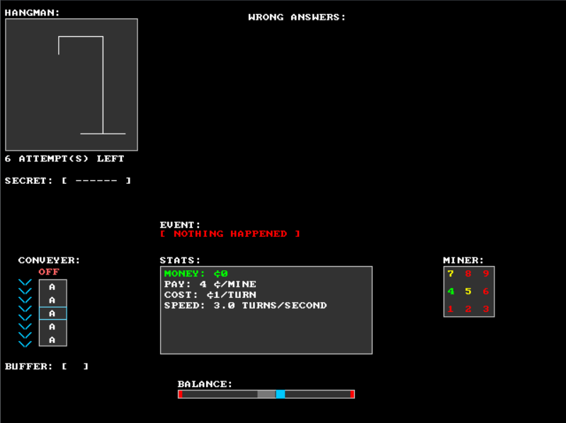
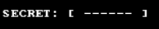
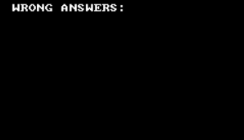
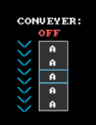
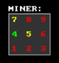
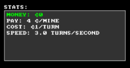
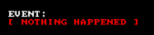

# HangMan Game

---

#### About

HangMan Game is a game that is similar to the classic game of hangman but with a couple of features to make it more difficult

---

#### Usage

Hangman Game requires a words.txt file in the working directory for Hangman Game to launch. The words.txt file must have words that are seperated by new lines for Hangman Game to read properly

---

#### Features

HangMan Game has multiple features that make the game more difficult. The first feature is the secret, the secret is the word that the player must find:

Another feature is the hangman box, this tells you how many tries the player has to find out the secret word:

Another feature is the wrong word list, this contains the patterns that are not in the secret word:

Another feature is the conveyer, the conveyer will circle around with unorganized characters. The direction that the conveyer will spin is indicated by the colored arrows to the left of the conveyer. The conveyer needs money to run, if there is no money, the conveyer will turn off. The conveyer can also be turned on and off at will. The speed and direction of the conveyer can also be controlled. The selection box in the middle of the conveyer indicates what character will be sent to the buffer:

Another feature is the buffer, the buffer can store a pattern of characters that are selected by the conveyer, then the buffer will be sent to the secret to check if the pattern exists in the secret word.

Another feature is the miner, the miner has a grid of numbers ranging from 1 to 9. The miner allows the player to earn money, the player earns money by pressing the number that is green in the grid using the number keys on the keyboard. The yellow keys will try to trick you into pressing them and remove some money, and the red keys will remove 1.5x the amount of money you earn:

Another feature is the balancer, the balancer forces the player to balance the blue square and to prevent it from touching the red rectangles on both sides of the bar. If the player lets the blue square touch the red rectangles, then the player will lose the game:

Another feature is the status menu, the status menu shows the player the stats of some features. The status menu shows: the amount of money the player has, the pay of the miner, the cost of the conveyer, and the speed of the conveyer:

The last feature is the event feed, the event feed shows the player a random event that is happening. The events can change how the game is played. The events include: nothing happening, change in pay, change in conveyer cost, change in conveyer speed, and change in the balancer velocity:

---

#### How To Play 

The controls in this game are:

- C | Pause & Unpause The Conveyer
- Space | Move Selected Character to The Buffer
- Enter | Send The Buffer to The Secret
- 1-9 | Miner inputs
- Left & Right Arrows | Move Blue Square in Balancer left & right
- Up & Down Arrows | Change Conveyer Speed

---

#### Goal

Figure out the secret word to win and don't lose